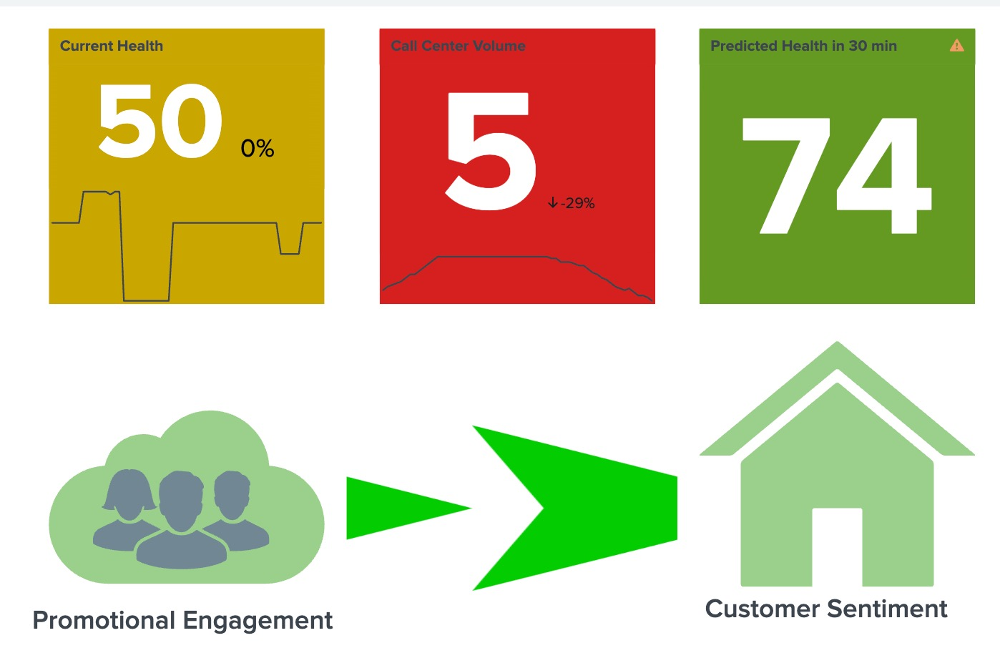
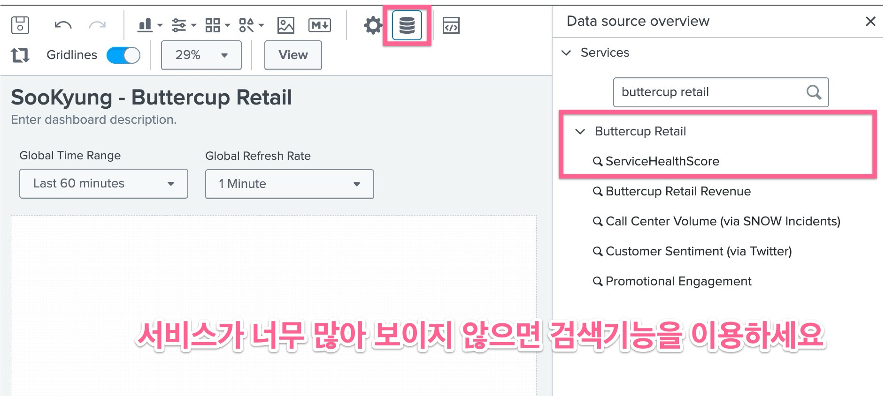
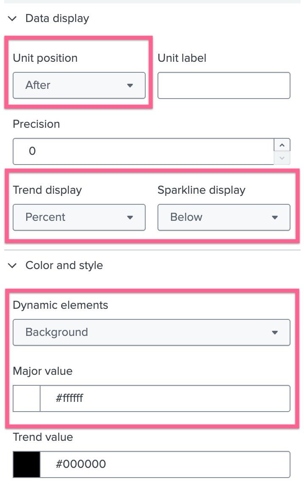
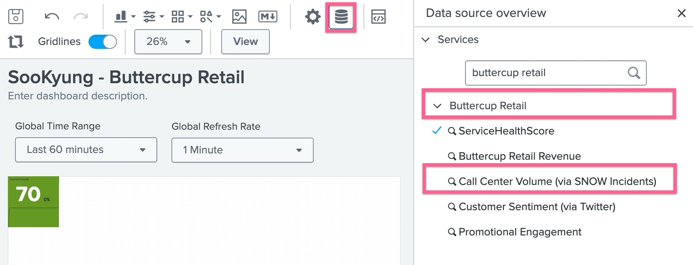
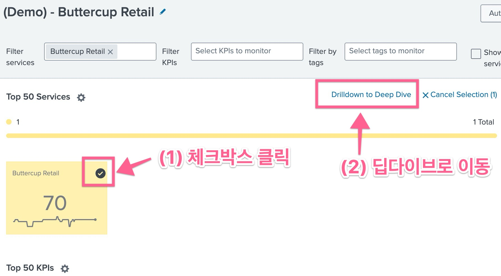

이 모듈에서는 _Buttercup Checkout_ 서비스의 상태를 시각화 하기위한 글래스테이블을 만듭니다. 모든 필요한 그래픽 요소는 글래스테이블 아이콘 세트에서 사용 할 수 있으며, 마지막 태스크에서는 따로 제공드리는 파일을 사용 할 수 있습니다

- [Task 1 : 위젯을 포함하여 _Buttercup Retail_ 서비스를 모니터링하는 글래스 테이블 만들기](#task-1--위젯을-포함하여-buttercup-retail-서비스를-모니터링하는-글래스-테이블-만들기)
- [Task 2 : Drilldown 추가하기](#task-2--drilldown-추가하기)
- [Task 3: 아이콘을 추가하고 위젯으로 사용하기](#task-3-아이콘을-추가하고-위젯으로-사용하기)
- [Task 4 : Predictive Analytics 대시보드로 Drilldown 추가하기](#task-4--predictive-analytics-대시보드로-drilldown-추가하기)
- [Task 5 : 추가 아이콘 설정하기 (Optional)](#task-5--추가-아이콘-설정하기-optional)

---

**Scenario** : _Buttercup Checkout_ 서비스의 운영팀은 아래 이미지와 같은 것을 보고싶어합니다. ITSI 관리자는 이미 어떤 KPI를 사용할지 파악하고 요구사항이 포함된 아래 표를 만들었습니다.

---

| Glass Table Icon Title      | KPI/Service Name in ITSI | Nots                                |
| --------------------------- | ------------------------ | ----------------------------------- |
| Current Health              | Buttercup Checkout SHC   |                                     |
| Predicted Health in 30 min. | Ad hoc search            | From Predictive Analytics Dashboard |
| Volume                      | Volume                   | Volume KPI                          |
| Views                       | Views                    | Views KPI                           |
| Purchases                   | Purchases                | Purchases KPI                       |

아래 이미지는 이 실습에 포함된 모든 과제의 결과를 보여줍니다.

# Task 1 : 위젯을 포함하여 _Buttercup Retail_ 서비스를 모니터링하는 글래스 테이블 만들기

1. ITSI 메뉴바에서 **Glass Tables** 메뉴로 이동하여 [Create Glass Table] 버튼을 누릅니다.

   - Title : _<student_name>_ - Buttercup Retail
   - Permission : Shared in App
   - [Create] 버튼을 누릅니다.

2. 목록 화면에서 방금 만든 글래스테이블의 Edit > Edit 버튼을 눌러 수정화면으로 이동합니다
3. 에디터 화면에서 상단 메뉴에서 Data Overview 아이콘을 클릭하고 오른쪽에 보여지는 **Data source overview** 패널에서 서비스를 선택합니다
   **Buttercup Retail > Service Health Score**
   
4. 캔버스 위에 위젯이 추가되면 상단 메뉴에서 Configuration 아이콘을 클랙하고 아래와 같은 설정을 넣어줍니다
   - Visualization Type : Single Value
   - Title : Current Health
   - Data Display 메뉴 아래에서 Unit Postion : After
   - Trend Display : Percent
   - Sparkline display : Below
   - Color and style 메뉴 아래에서 Dynamic Elements : Background
   - Major value 아래 색상을 클릭하여 하얀색으로 바꿔줍니다
     
5. 흰바탕의 캔버스를 클릭 후 다시 Data Overview 아이콘을 눌러 새 위젯을 한번 더 추가합니다. 오른쪽에 뜨는 패널에서 아래 서비스를 선택합니다
   **Buttercup Retail > Call Center Volume (SNOW Incidents)**
   
6. 캔버스 위에 위젯이 추가되면 상단 메뉴에서 Configuration 아이콘을 클랙하고 아래와 같은 설정을 넣어줍니다
   - Title : Call Center Volume
   - Data Display 메뉴 아래에서 Unit Postion : After
   - Trend Display : Percent
   - Sparkline display : Below
   - Color and style 메뉴 아래에서 Dynamic Elements : Background
   - Major value 아래 색상을 클릭하여 하얀색으로 바꿔줍니다

# Task 2 : Drilldown 추가하기

1. 앞선 단계에서 작업하던 글래스테이블 창은 그대로 두고 새로운 ITSI 탭을 열어 작업을 지속합니다
2. **Service Analyzer > Default Analazer** 메뉴로 이동하여 Buttercup Retail 타일에서 오른쪽 위에 표시되는 체크박스를 누릅니다
3. 파란색으로 표시되는 Drilldown to Deep Dive 링크를 클릭합니다.
   

   > [!Note]
   > 이 단계에서 만들어진 Deep Dive 페이지의 링크를 복사해둡니다

4. 열어놓은 글래스테이블 탭에서 **Current Health** 위젯을 클릭하면 오른쪽에 보여지는 **Configuration** 패널의 **Interactions** 메뉴로 이동합니다 (Configuration 창의 가장 아래로 스크롤해야 있는 메뉴입니다)
5. [+ Add interaction] 을 클릭합니다
6. 아래와 같이 내용을 채웁니다

   - On Click : Link to custom URL 선택
   - URL : 앞 단계에서 복사한 Deep Dive 링크 붙여넣기
   - Open in new tab 체크
   - [Apply] 클릭

7. 오른쪽 상단의 [View] 버튼을 눌러 편집화면에서 빠져나온 후** Current Health** 위젯의 값을 클릭하여 딥다이브 창으로 이동이 되는지 확인합니다

# Task 3: 아이콘을 추가하고 위젯으로 사용하기

1. 작업하던 글래스테이블에서 [Edit] 버튼을 눌러 다시 편집화면으로 들어갑니다
2. 상단 메뉴에서 Add icon 버튼을 눌러 아이콘 세개를 추가합니다 : **Home, Cloud, Group**
3. 캔버스에서 **Group** 아이콘을 클릭하여 색상을 조정합니다.
   - Color and style 메뉴 아래에서 Icon 색상을 회색으로 선택
4. Group 아이콘이 Cloud 안에 들어갈 수 있도록 작게 조정하고 드래그하여 Cloud 위에 오버레이 합니다.
5. **Cloud** 아이콘을 클릭하여 아래와같은 설정을 추가합니다
   - Data Sources 메뉴 아래에서 [+ Set up primary data source] 버튼 클릭
   - Service 선택에서 **Buttercup Retail > Customer Sentiment** 선택
   - 변경이 반영되면 아이콘의 색깔이 KPI 임계치와 맞게 바뀝니다
6. Home 아이콘을 클릭하여 아래와 같은 설정을 추가합니다

   - Data Sources 메뉴 아래에서 [+ Set up primary data source] 버튼 클릭
   - Service 선택에서 **Buttercup Retail > Promotional Engagement** 선택
   - 변경이 반영되면 아이콘의 색깔이 KPI 임계치와 맞게 바뀝니다

7. 상단 메뉴에서 Markdown 버튼을 눌러 Cloud 와 Home 아이콘 아래에 각각 텍스트라벨을 추가 해 줍니다
   - Home 아이콘 : Customer Sentiment
   - Cloud 아이콘 : Promotional Engagement

# Task 4 : Predictive Analytics 대시보드로 Drilldown 추가하기

1. 작업하던 글래스테이블은 그대로 두고 새로운 ITSI 탭을 열어 **Dashboard > Predictive Analytics** 메뉴로 이동합니다
2. Service 드롭다운에서 **_Buttercup Retail_** 선택
3. Model 드롭다운에서 **LinearRegression** 선택
4. 돋보기 아이콘을 클릭합니다
5. 새 창에서 열리는 Seach 스트링을 복사하고, 글래스테이블 편집창으로 돌아옵니다
6. 상단 메뉴에서 Data source 아이콘을 클릭하고 [+ Create Ad hoc Search] 를 클릭합니다
   - Data Source Name : Predicted Buttercup Retail Health
   - Search : 앞 단계에서 복사한 서치 스트링을 붙여넣기 합니다
   - [Apply & Close]
7. 흰 캔버스 영역을 클릭했다가 추가된 예측 위젯을 다시 클릭하여 아래와 같은 내용을 추가합니다
   - Title : Predicted Health in 30 min
   - Data Disply 메뉴 아래에서 Sparkline Display : Off
   - Color and style 메뉴 아래에서 Dynamic elements : Background
   - Major value 아래 색상을 클릭하여 하얀색으로 바꿔줍니다
8. Predictive Analytics 대시보드로 돌아와서 해당 대시보드의 URL을 복사 해 줍니다
9. 글래스테이블 화면에서 방금 만든 예측 위젯을 클릭 후 [+ add Interaction] 버튼을 누릅니다. (오른쪽 패널의 가장 아랫쪽에 있습니다)
10. 아래와같이 내용을 입력합니다
    - On Click : Link to custom URL 선택
    - URL : 앞 단계에서 복사한 Deep Dive 링크 붙여넣기
    - Open in new tab 체크
    - [Apply] 클릭
11. 이제 각 위젯을 맞는 자리로 옮겨놓은 후 저장합니다.
12. [View] 버튼을 눌러 편집모드에서 빠져나온 후 Predictive Analytics 대시보드로 이동하는지 위젯을 클릭하여 확인합니다

# Task 5 : 추가 아이콘 설정하기 (Optional)

1. 글래스테이블 편집모드에서 Image 아이콘을 클릭하여 이미지 위젯을 추가합니다
2. Configuration 패널에서 **arrow.gif** 파일을 드래그하여 첨부합니다
3. Preserve aspect ratio 체크 해제
4. 화살표를 클라우드와 홈 아이콘 사이에 위치시킵니다
